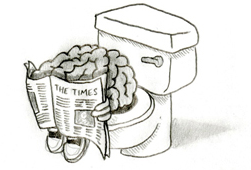
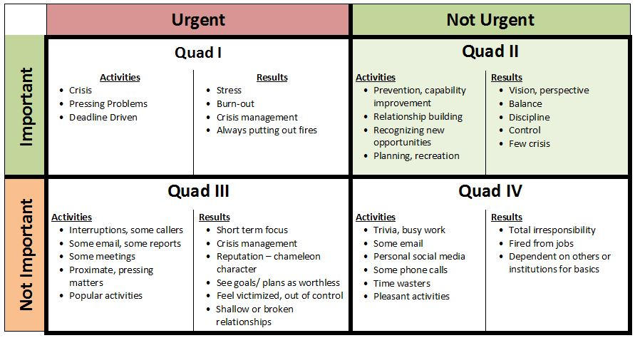
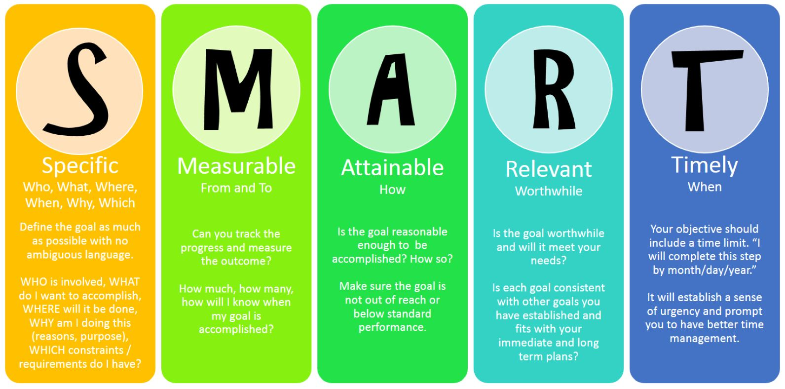

# Time

## Management

Notes:

Start met [TED-talk van Tim Urban.](https://www.ted.com/talks/tim_urban_inside_the_mind_of_a_master_procrastinator)
Vertel ook dat een workshop als deze normaal tussen de 1000 en 2500 € kost. Ze hebben met andere worden hun inschrijvingsgeld al terug verdiend gewoon door vandaag aanwezig te zijn en goed mee te werken.

&&&

## Doel

- Nooit meer iets vergeten <!-- .element: class="fragment" -->
- Nooit moeten nadenken over wat je nu moet doen, behalve op momenten die daarvoor voorzien zijn <!-- .element: class="fragment" -->
- Minder stress <!-- .element: class="fragment" -->
- Meer productiviteit <!-- .element: class="fragment" -->
- Hogere efficiëntie <!-- .element: class="fragment" -->

&&&

<!-- .slide: data-background-image="images/zen-water.jpg" data-background-size="contain" -->

> Mind like water 
> -- David Allen 

 
 
 

Notes:

David Allen: één van de grootste en bekendste productiviteitsgoeroes. Grondlegger van een methode die GTD (getting things done) heet.
Wanneer je een steen in een plas stilstaand water gooit, zal het water altijd exact reageren zoals vereist is door de grootte van de steen en de kracht waarmee hij in het water landt. Het water overreageert of onderreageert nooit. Het doel van goed time management is volgens hem dat je altijd klaar staat om exact juist te reageren, nooit meer energie gebruiken dan nodig, maar ook nooit te weinig doen, om een stressvrij bestaan te kunnen leiden.

&&&

## Opdracht

Neem 12 minuten tijd en schrijf alle taken op waarvan je weet dat je ze nog moet doen. Dat mag voor school zijn, maar ook andere.

Notes:

Normaal moet je zeker aan een 20-tal items geraken

&&&

 <!-- .element: class="fragment" -->

## Brain Dump <!-- .element: class="fragment" -->

Notes:

Wat we nu gedaan hebben heet een ‘brain dump’

&&&

## Actionable (doe-baar)

- Gebruik een werkwoord <!-- .element: class="fragment" -->
- Wees zo specifiek mogelijk <!-- .element: class="fragment" -->
- Formuleer zo dat je weet wanneer je klaar bent (finishing conditions) <!-- .element: class="fragment" -->

&&&

## Taken vs. Projecten

- Groepjes taken die samen horen / van elkaar afhangen
  => een project <!-- .element: class="fragment" -->
- Taken die te groot zijn om in één keer te doen (langer dan één uur geschat werk)
  => opsplitsen en een project van maken <!-- .element: class="fragment" -->

Notes:

Anders te groot, wat leidt tot onoverzichtelijkheid / stress. Angst om eraan te beginnen. Als je de Mount Everest wil beklimmen deel je dat ook in etappes in. Als je met de fiets de Mont Ventoux opfietst denk je na een tijdje van lantaarpaal tot lantaarnpaal. Dat is makkelijker opm vol te houden dan het besef dat je nog 20 km aan een stuk moet klimmen.

&&&

## Next Actions

Notes:

Een next-action is de eerstvolgende taak die je kan doen om een project dichter bij zijn voltooing te brengen. (Soms kunnen 2 of 3 next-actions onafhankelijk van elkaar/in parallel uitgevoerd worden). Zorg ervoor dat je altijd van elk project de next-action kent. (Het is vaak niet nodig om verder te plannen dan de volgende next-action, maar dat is wel het minimum cf: agile, wat hogere prioriteit heeft/dichterbij is weet je in detail; wat verder af is hoef je niet in detail te weten of is nog helemaal onbekend)

&&&

## Opdracht

- Groepeer of splits waar nodig je takenlijst in projecten en taken
- Maak je lijst actionable
- Zorg voor next actions

---

# Prioriteiten

&&&

## Prioriteiten

Notes:

- Stephen Covey is nog zo’n productiviteitsgoeroe. Zijn bekendste boek is 'The 7 habits of highly productive people‘ en 'First Things First'. David Allen werkt heel erg bottom up, Covey is meer top-down.
- Kwadranten: streven om zoveel mogelijk bezig te zijn met zaken uit QII.

&&&

## Opdracht

Duidt bij elke taak het kwadrant aan.

Notes:

Vraag als ze klaar zijn of dit makkelijk of moeilijk was. Wat waren problemen? Normaal ga je als antwoord krijgen dat het soms moeilijk is om te weten wat belangrijk is.

&&&

## Wat is belangrijk?

Notes:

David Allens methode helpt je om je todo-lijst efficiënt te beheren en om op korte tijd veel te kunnen doen. Coveys kritiek daarop is dat als je veel dingen doet, maar als dat niet de juiste dingen zijn je niets aan echte productiviteit gewonnen hebt. Je bent gewoon hard bezig geweest. (Busy time).
Covey formuleert hier dus een heel eenvoudig antwoord op =>

&&&

## Brengt het je dichter

## bij je doel(en)?

&&&

## Dus

---

## Persoonlijke

# doelen

## kennen

&&&

# SMART

# Goals

Notes:

Probleem met veel doelen is als met goede voornemens: als je ze te vaag formuleert, heb je er niets aan.

Bijv. Ik wil gezonder gaan leven is veel te vaag.

&&&

Notes:

Ik wil op 30 juni 10 kg minder wegen dan nu en ik wil dat doen door te stoppen met limonades te drinken, gezondere snacks te eten (minstens twee keer per dag een stuk fruit in plaats van een koek of chocolade), maximum 1 keer per week junk food te eten en geen chips meer te eten voor de televisie en door drie keer per week met de fiets naar school te komen en twee keer per week een uur te gaan zwemmen.

Dat is een hele boterham, maar je weet dat dat haalbaar is, je weet dat dat gaat helpen aan je vage doel en je kan op 30 juni weten of het gelukt is, maar ook op elk moment tussendoor kan je ook al weten of je goed bezig bent of niet (meetbaar). Hier kan je mee aan de slag.

Ander voorbeeld: je wil meer tijd met familie en vrienden doorbrengen is vaag. Om de twee weken langs je grootouders gaan is veel concreter.

&&&

## Opdracht

Formuleer je belangrijkste doelen op een SMART manier

Notes:

Laat de studenten een aantal persoonlijke doelen formuleren. 1 geldt al zeker voor iedereen: het diploma halen binnen de voorziene tijd. (Is SMART).
Laat ze daarna opnieuw kijken naar de kwadranten die ze toegekend hebben aan hun taken. Zijn er wijzigingen?

&&&

## Opdracht

- Kijk terug naar de prioriteiten (kwadranten) op je takenlijst met je doelen in het achterhoofd.
- Zijn er wijzigingen?

---

# ↑ Todo-lijst

# ↓ Kalender <!-- .element: class="fragment" -->

Notes:

Alles tot nu ging over todo lists / takenlijsten

&&&

## Kalender

Alles (en niets meer) dat op een bepaald moment (en vaak bepaalde plaats) moet gebeuren:

- **afspraken**
- _geen_ deadlines (zet je bij de taak)

Notes:

Dit onderscheid vinden studenten vaak lastig

---

# Inbox

Elke weg waarlangs een taak binnenkomt in je systeem <!-- .element: class="fragment" -->

&&&

## Opdracht

Maak een lijstje van al je inboxen

Notes:

Eentje heeft al zeker elke student: Canvas

---

# Planning

Notes:

Hoe pak je het dan concreet aan om tot een goede planning te komen

&&&

## Jaarlijks

- Grote doelen vastleggen
- _Persoonlijke missie bijschaven_

Notes:

Persoonlijke missie of personal mission statement is optioneel (ben je al gauw twee halve dagen mee bezig, maar het kan wel interessant zijn om te doen wanneer je niet zo goed (meer) weet waar je met je leven heen wil.

Grote doelen: bijv. Diploma halen

&&&

## Maandelijks

- Belangrijkste doelstellingen vastleggen
- Werkpunten voor die maand

Notes:

Kleinere doelen/grote projecten die bijdragen aan het halen van je grote doelen. Bijv. een stageplaats vinden; goede cijfers halen voor een bepaald vak...

&&&

## Wekelijks

- Brain dump
- Agenda bijwerken
- Todo lijst & projectlijst bijwerken
- Belangrijkste projecten en taken voor de week aanduiden

Notes:

- Zondagavond is hier vaak een ideaal moment voor.
- Brain dump is uiteraard minder uitgebreid. Vooral de vraag stellen of er nog iets ontbreekt op je lijst.
- Todolijst bijwerken =
  - Projecten zonder next actions fixen
  - Taken die niet meer relevant zijn schrappen
  - Deadlines bijwerken
- Dit kan wel 15 - 20 minuten duren.

&&&

## Dagelijks

- Inboxen leegmaken
- Agenda nakijken
- MIT (Most Important Tasks) vastleggen = 3 - 5 belangrijkste taken voor de dag

Notes:

- ’s ochtends of de avond tevoren (ik doe dit liefst 's avonds)
- als je hier een beetje in getraind bent, is dat niet meer dan 5 à 10 minuten werk, tijd die je ruimschoots terugwint omdat je overdag niet voortdurend moet nadenken wat je nu weer moest doen

&&&

## Klaar met een taak

- Deeltaak van project => volgende next action aanduiden / bedenken & noteren
- Volgende MIT beginnen

Notes:

- Belang van Next Action bij project: anders valt het project stil
- Eigenlijk zou je ooki je agenda moeten checken om te weten of je een afspraak hebt, maar reminders kunnen die last van je overnemen

---

# Waarom alweer?

Notes:

- Als je productief wil zijn, maar je moet dan nog bedenken wat je moet doen, heeft de Instant Gratification Monkey de ideale kans om het roer over te nemen.
- De hele tijd dingen proberen onthouden, omdat je geen systeem hebt of omdat je systeem niet waterdicht is geeft veel onrust in je hoofd, waardoor er minder capaciteit overblijft om interessante/belangrijke dingen te doen.
- Als je weet dat je klaar bent met je werk voor de dag en dan ontspant, heb je geen last van schuldgevoel, want je weet dat je niet in de Dark Playground zit.
- Als je je prioriteiten goed gebruikt ga je al snel het gevoel krijgen (terecht) dat je leven de goede richting uit gaat en dat je niet ter plaatse aan het trappelen bent.

---

# Tips

&&&

## Universal Capture

Notes:

- Sla alles onmiddelijk op in een betrouwbaar systeem, zodat je het niet in je werkgeheugen moet vasthouden (geeft stress en verminderde capaciteit om na te denken).
- Als je weinig details hebt noteer je het gewoon heel kort en zet je het bij je

&&&

## Inboxen beperken

Notes:

Langs hoe minder wegen taken/afspraken bij jou geraken, hoe beter.
Bijv. als ICT-team hadden wij op school de afspraak dat collega’s problemen via mail moesten melden. Wat in de leraarskamer gezegd werd, vergaten we toch. We moesten onze collega’s daar wel in trainen.

&&&

## Next actions

Notes:

Als je een taak afgerond hebt die bij een project hoort, duidt dan onmiddellijk aan wat de volgende next-action is voor dat project. Anders is de kans groot dat je project stil valt.

---

# Procrastinatie

## **tegengaan**

&&&

## Hou je taken klein

Notes:

- Denk aan de Mont Ventoux of de Mount Everest
- Als de Rational Decision Maker een taak niet ziet zitten, neemt de Monkey direct over.

&&&

## Hou je taken actionable

Notes:

- Aan wat je niet kan doen, kan je niet beginnen...
- Als je bij het beginnen van een taak te lang moet nadenken over wat je nu weer moest doen, loert de Monkey om de hoek.

&&&

## Beperk je MIT's

Notes:

Mont Ventoux, maar ook keuzestress + minder kans dat je alles gedaan krijgt en dat werkt demotiverend.

&&&

## Kwadrant 2

Notes:

Dat is waar je Zen vindt, waar de efficiëntie zit en waar de dingen zitten die je zonder extra stress dichter bij je doelen brengen.

&&&

## Begin met iets makkelijk/moeilijk

Notes:

Hier is veel discussie over tussen productiviteitsgoeroes en -methodes. Sommigen zeggen begin met je moeilijkste taak van de dag, dan ben je er al vanaf en lijkt alles wat je die dag nog verder moet doen makkelijk ('Eat that frog first'), anderen zeggen om net met iets makkelijks te beginnen, zodat je al heel vroeg in de dag een succeservaring hebt die je kan helpen om in een flow te geraken ('Make up your bed everyday').

Volgens mij hangt veel af van wanneer je het meeste energie hebt: ochtendmensen zijn waarschijnlijk best met de Eat that frog first-mentaliteit.

Mijn truc is om de avond tevoren alles klaar te leggen/zetten voor mijn eerste taak (niet te moeilijk) van de dag, dan kan ik daar al geen tijd mee verliezen en is de stap om eraan te beginnen kleiner. Toen ik op een kantoor werkte, had ik een kaftje waar in grote letters START op stond, daarin stak ik mijn todo-lijst voor de volgende dag en alle documenten die ik nodig had voor mijn eerst taak.

&&&

## Kill Distractions

Notes:

Trucs:

- Een aparte werkcomputer en een pretlaptop of tablet.
- Minder extreem: een aparte user account op je computer waarbij je enkel shortcuts hebt voor je productieve programmas en zelfs een restrictieve browser die je bijv. niet op facebook/instagram/reddit etc. laat (je kan heel veel doen met parental controls).
- Zet je smartphone in airplane-mode en/of laat hem in een andere ruimte.
- Installeer hulpmiddelen zoals [coldturkey](https://getcoldturkey.com/), [StayFocusd](https://chrome.google.com/webstore/detail/stayfocusd/laankejkbhbdhmipfmgcngdelahlfoji), [Forest app](https://www.forestapp.cc/) of [andere](https://freedom.to/blog/8-website-blockers-for-studying-productivity-focus/)
- Maak afspraken met huisgenoten/collega’s. Bijv. deur dicht is alleen storen als er brand is of iemand op sterven ligt; deur op een kier is ik ben geconcentreerd aan het werken, maar als je vindt dat het dringend is, mag je aankloppen; deur open: ik ben niet aan het werk of ik ben domme taakjes aan het doen, kom maar binnen.

&&&

## Beloon jezelf voor kleine overwinningen

Notes:

- doe dit, echt, maar let wel op
- rokers hebben hierbij een voordeel en kennen dit, maar is geen aanrader (geloof een ex-roker)
- bij kleine overwinningen kan even de benen strekken vaak al voldoende zijn of jezelf een complimentje geven
- pas op met time sinks: even facebook checken, 1 aflevering kijken, 1 potje gamen... Voor je het weet zit je aan aflevering 3 van seizoen 2 van The IT-crowd en ken je elke grap van buiten...
- Zo hou je de Instant Gratification Monkey tevreden en neemt hij niet als een opstandige puber het roer over

&&&

## Rituelen

Notes:

Pavlov-effect werkt ook bij mensen, maak hier gebruik van:

- Als je bepaald werk vaak beter doet op een bepaalde plek, doe dat dan. Kan ook muziek zijn die je opzet, een specifieke kop waaruit je koffie drinkt bij het werken etc.
- Als ik veel verbeterwerk heb, ga ik altijd naar dezelfde koffiebar.
- Als ik een tekst moet schrijven zet ik altijd het VIoolconcerto van Saint-Saens op, gewoon omdaét dat hielp om mij te concentreren toen ik mijn thesis schreef en nu kom ik nog steeds in een schrijf-flow als ik dat op zet.

&&&

## Pomodoro Technique

Notes:

DE GROTE REDDER IN NOOD!! Van alle technieken die we bespreken is dit in mijn ervaring de krachtigste om de negatieve cyclus van uitstelgedrag en fear of starting te doorbreken.
Het is een idee van Francesco Cirillo, een Italiaan. In Italië hebben de keukenwekkers de vorm van een tomaat (pomodoro) i.p.v. een ei.

De techniek bestaat eruit om een timer te zetten voor 25 minuten. Gedurende die tijd werk je volledig gefocust en dan neem je 5 minuten pauze. Dit herhaal je vier keer (= 2 uur) en dan neem je een langere pauze (half uur). Daarna begin je opnieuw.

Voordeel is dat je jezelf maar moet pushen om 25 minuten te werken en dat kan zelfs een kleuter in principe. (Tegen de instant gratification monkey zeggen dat hij je even 25 minuten gerust moet laten en dat dat echt niet lang is, lukt meestal wel. Een berg afwas van een week doen is een heel ander verhaal dan 25 minuten afwassen; 25 minuten studeren is minder onoverkomelijk dan een hele cursus blokken etc.)

Als je de techniek helemaal volgt moet je ook streepjes zetten elke keer je afgeleid wordt en dan is het de bedoeling om een soort wedstrijdje van jezelf te maken om zo weinig mogelijk streepjes te hebben. Zo train je ook je focus.

Als je met deze techniek begint (en je hebt echt veel last van uitstellen en/of je hebt moeite om te focussen) is 15min - 5 min soms haalbaarder en je vandaar opbouwen. Zelfs 10min-10min is al winst als het alternatief Netflix en niets is.

Er bestaan veel apps die deze techniek implementeren. Bijv. [Forest app](https://www.forestapp.cc/) combineert dit met distraction blocking en gamification omdat je een bos bijeen probeert te sparen.

&&&

## Time Boxing

Notes:

Als je een volle agenda hebt met veel afspraken (bijv. lessen) en vergaderingen of aald je vaak beschikbaar moet zijn voor onderbrekingen (bijv. op een helpdesk waar je telefoons en e-mails moet beantwoorden) heb je vaak het gevoel dat er geen tijd is om geconcentreerd en productief door te werken aan je taken.

Daarom is het goed om in je kalender vaste momenten in te plannen voor geconcentreerd werk (de details van welk werk je dan doet laat je over aan je todo-list, maar je blokkeert tijd in je kalender/agenda).

Veel managers plannen zo een aantal wekelijks terugkerende meetings met zichzelf, liefst in een afgelegen lokaaltje om tot echt werk te komen. Dat heet time-boxing dat kan je zelf ook toepassen bijv. elke zondag van 13:00-16:00 en elke woensdag van 15:00 - 17:00 werk je voor je studie).

Door dat in te plannen weet je dat je elke week een aantal uur geconcentreerd zal werken (soms zal je nog extra momenten moeten zoeken, maar soms zal dat voldoende zijn). Zo blijf je ook makkelijker in Q2 en de regelmaat zal ook het Pavlov effect versterken dat de Instant Gratification Monkey dan even een dutje moet doen.

&&&

## Pas op voor productivity porn!!

Notes:

Probeer uit en zoek een systeem dat voor jou werkt, maar eens het werkt, blijf je er best bij. Voortdurend je systeem tweaken en proberen verbeteren aan de hand van de nieuwste, hipste apps en technieken is heel verleidelijk tijdverlies. Zo kan productiviteit zelf een bron van uitstelgedrag worden.

---

# GTD Flow

&&&

## Stuff

Not actionable:

- trash <!-- .element: class="fragment" -->
- reference <!-- .element: class="fragment" -->
- someday <!-- .element: class="fragment" -->

Notes:

Met stuff wordt alles bedoelt dat op je afkomt. Vragen, e-mails, documenten die je krijgt etc.

&&&

## Stuff

Actionable:

- less than 2 minutes => do it <!-- .element: class="fragment" -->
- more than two minutes <!-- .element: class="fragment" -->
  - time-specific => calendar <!-- .element: class="fragment" -->
  - not time-specific => todo list <!-- .element: class="fragment" -->

&&&

<!-- .slide: data-background-image="images/gtd-flow.png" data-background-size="contain" -->

---

# To paper

## **or**

# not to paper

Notes:

- Papier heeft een aantal voordelen:
  - batterij kan niet leeg geraken
  - iets manueel opschrijven doet iets met onze hersenen, waardoor we het beter onthouden en waardoor het concreter lijkt
  - het genot van een afgewerkte taak doorstrepen
- Digitaal heeft ook een aantal voordelen:
  - Reminders
  - Geen gedoe met bic en potlood

&&&

# Papier

Agenda & notitieboekje

&&&

# Online / Apps

- Calendar: bijv. Outlook kalender, Google kalender (met alarmen)
- Todo-list: bijv. Todoist, Wunderlist
- Reference/Notebook: bijv. Onenote, Evernote

---

# Opdracht

- Probeer gedurende drie weken het werken met een kalender en een todo-lijst uit
- Experimenteer ook met de tips
- Beschrijf elke week kort je belangrijkste ervaringen (telkens 250 - 500 woorden)

Notes:

Volgens gedragspsychologen heb je drie à vier weken nodig om je een gewoonte eigen te maken...

---

# Bronnen

- Allen, David: Getting Tings Done. Te Art of Stress-Free Productivity. 2001. New York: Penguin Books.
- [Babauta, Leo: Zen To Done. Te Ultimate Simple Productivity System.](http://zenhabits.net/zen-to-done-the-simple-productivity-e-book/)
- [Cirillo, Francesco: The Pomodoro Technique. 2007.](http://www.pomodorotechnique.com/resources/TePomodoroTechnique_v1-3.pdf)

&&&

- Covey, Stephen R.: The 7 Habits of Highly Efective People. Powerfull Lessons in Personal Change. 1989. London: Simon & Schuster.
- Covey, Stephen R., A. Roger Merril & Rebecca R. Merril: First Tings First. 2003. London: Simon & Schuster.
- Mead, Jonathan: Reclaim Your Dreams. An uncommon Guide to Living

---

## Licentie

- Deze slideshow is gemaakt door [@lars-derichter](https://github.com/lars-derichter)
- Beschikbaar onder de volgende Creative Commons licentie: [Naamsvermelding-NietCommercieel-GelijkDelen 4.0 Internationaal (CC BY-NC-SA 4.0)](https://creativecommons.org/licenses/by-nc-sa/4.0/deed.nl).
